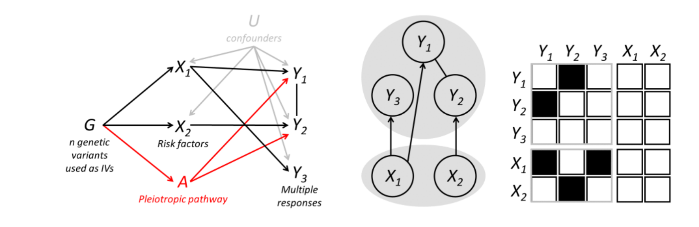

# MR<sup>2</sup>: Multi-response Mendelian randomisation

This R-package (version **0.1.1**) introduces multi-response Mendelian randomization ([Zuber et al., 2023](https://doi.org/10.1016/j.ajhg.2023.06.005)), a novel two-sample summary-level MR methodology specifically designed for multiple outcomes to identify exposures that cause more than one outcome or, conversely, exposures that exert their effect on distinct responses. **MR<sup>2</sup>** uses a sparse Bayesian Gaussian copula regression framework to detect causal effects while estimating the residual correlation between summary-level outcomes, *i.e.*, the correlation that cannot be explained by the exposures, and *viceversa*.

This package performs Bayesian risk factors selection and direct causal effects estimation as well as the evaluation of the residual correlation between responses using a recently proposed Bayesian Variable Selection (BVS) algorithm for Gaussian Copula Regression models ([Alexopoulos and Bottolo, 2021](https://doi.org/10.1080/10618600.2020.1840997)).

The current version of **MR<sup>2</sup>** allows the specification of a decomposable or non-decomposable graphical model for the conditional dependence structure between the responses. The latter instance of the algorithm takes full advantage of the C++ computational efficiency of the recently proposed R-package BDgraph ([Mohammadi and Wit, 2019](https://doi.org/10.18637/jss.v089.i03)) to sample non-decomposable graphs. The current version of the package can also analyse summary-level data with missing at random in the responses. 

**MR<sup>2</sup>** returns the posterior samples of the non-zero regression coefficients, the direct causal effect estimates as well as the sparse residual covariance matrix between the responses. A post-processing routine summarizes all quantities of interest, returning the posterior mean and the (1-&alpha;)-credible intervals and useful summary statistics to detect outliers or high-leverage and influential observations. Finally, a False Discovery Rate (FDR) procedure based on Beta density finite mixture model ([Broet etal., 2004](https://doi.org/10.1093/bioinformatics/bth285)) is included to facilitate the selection of important risk factors while controlling for FDR. 

To favour the comparison with other MR models, **MR<sup>2</sup>**  includes several functions to simulate the scenarios presented in [Zuber et al. (2023)](https://doi.org/10.1016/j.ajhg.2023.06.005), and in particular:

<ul>
    <li> Undirected pleiotropy: Residual correlation between outcomes is induced by a shared undirected pleiotropic pathway which can increase or decrease the level of the responses;</li>
    <li> Directed pleiotropy: Residual correlation between outcomes is induced by a shared directed pleiotropic pathway which only increases the level of the responses;</li>
    <li> Dependence: Outcomes are simulated with correlated errors mimicking the effect of non-genetic factors that contribute to their correlation.</li>
</ul>

## Installation

The installation of **MR<sup>2</sup>** requires the following steps:

1.  Install the [**devtools**](https://github.com/r-lib/devtools)
    package. This can be done from
    [**CRAN**](https://cran.r-project.org/). Invoke R and then type
    
    ``` 
     install.packages("devtools")
    ```

2.  Load the **devtools** package
    
    ``` 
     library("devtools")
    ```

3.  Install **MR<sup>2</sup>** package by
    typing
    
    ``` 
     devtools::install_github("lb664/MR2")
    ```

4.  Finally, load the **MR<sup>2</sup>** package
    
    ``` 
     library("MR2")
    ```

## Example 1

Installation can be checked by running the following example.  It consists of one replication of simulated Scenario II-Confounding presented in [Zuber et al. (2023)](https://doi.org/10.1016/j.ajhg.2023.06.005) with q = 5 responses, p = 15 exposures and nIV = 100 genetic variants used as IVs. For reproducibility of the simulation, the seed is set at 28061971.

<!---
# 80 characters ###############################################################
-->
    
    Sim_Confounding <- Scenario_Confounding(nRep = 1, q = 5, p = 15, nIV = 100)
    betaHat_Y <- Sim_Confounding$betaHat_Y
    betaHat_X <- Sim_Confounding$betaHat_X

For the analysis of the simulated dataset, the number of expected exposures directly associated with each response is set at 2 and its variance at 2, with a priori range of direct causal association ranging between 0 and 8 for each response, with 7,500 Markov chain Monte Carlo iterations of which 2,500 as burn-in. After the burn-in, the output of the algorithm is saved at every 5th iteration, resulting in 1,000 posterior samples. For reproducibility of the analysis, the seed is set at 28061971.

    MR2_output <- MR2(betaHat_Y, betaHat_X, EVgamma = c(2, 2), niter = 7500, 
                      burnin = 2500, thin = 5, monitor = 500)

Post-processing analysis

    PostProc_output <- PostProc(MR2_output, betaHat_Y, betaHat_X)

reveals a good match between the posterior mean of the direct causal effect estimates and the simulated ones

    cor(c(PostProc_output$thetaPost), Sim_Confounding$theta)

which is close to 0.99.

## Example 2

This second example is related to the analysis of one replication of simulated Scenario IV-Directed pleiotropy presented in [Zuber et al. (2023)](https://doi.org/10.1016/j.ajhg.2023.06.005) with q = 5 responses, p = 15 exposures and nIV = 100 genetic variants used as IVs and the effect of the shared pleiotropic pathway on the responses set as 2. In this particular replicate, 29% of all exposures-response pairs are simulated with non-zero effects.

In the analysis, the number of expected exposures directly associated with each response is set at 1 and its variance at 2, with a priori range of direct causal associations ranging between 0 and 7 for each response. A non-decomposable graph for the inverse of the residual correlation between responses is selected.

<!---
# 80 characters ###############################################################
-->

    Sim_Pleiotropy <- Scenario_Pleiotropy(nRep = 1, q = 5, p = 15, nIV = 100, 
                                          undirectedA = FALSE)
    betaHat_Y <- Sim_Pleiotropy$betaHat_Y
    betaHat_X <- Sim_Pleiotropy$betaHat_X

    MR2_output <- MR2(betaHat_Y, betaHat_X, EVgamma = c(2, 2), niter = 15000, 
                      burnin = 5000, thin = 10, monitor = 1000, 
                      nonDecomp = TRUE)

    PostProc_output <- PostProc(MR2_output, betaHat_Y, betaHat_X)

The FDR procedure starts with the estimation of the Beta density finite mixture model

    BMM_EM_output <- BMM_EM(PostProc_output$gammaPost)
    
The estimated proportion of non-zero direct causal effect is very close to the simulated one

    BMM_EM_output$p[2]

around 33%.

Finally, the cut-off point at the designed level of FDR is obtained by running
 
    FDR_BMM_output <- FDR_BMM(BMM_EM_output$PPI, BMM_EM_output$w, FDR_nominal = 0.10)
    FDR_BMM_output$cutoff

At the designed 10% FDR level,

    sum(matrix(abs(Sim_Pleiotropy$theta), 15, 5) > 0)   # Number simulated causal effects

    sum(PostProc_output$gammaPost > FDR_BMM_output$cutoff)   # Number significant estimated causal effects

    sum((matrix(abs(Sim_Pleiotropy$theta), 15, 5) > 0) * 
        (PostProc_output$gammaPost > FDR_BMM_output$cutoff))   # Number TPs

    sum((matrix(abs(Sim_Pleiotropy$theta), 15, 5) > 0) - 
        (PostProc_output$gammaPost > FDR_BMM_output$cutoff) < 0)   # Number FPs

20 out of 22 true causal effects are correctly identified (91% power) and 4 out of 24 are falsely associated (16% realised FDR).

## News/changelog

For a version history/changelog, please see [Changelog](https://github.com/lb664/MR2/blob/master/CHANGELOG.md)

## Issues

To report an issue, please use the **MR<sup>2</sup>** issue tracker at [BugReports](https://github.com/lb664/MR2/issues)

## License and authors

This software uses the GPL v2 license, see [License](https://github.com/lb664/MR2/blob/master/LICENSE). Authors and copyright are provided in [Description](https://github.com/lb664/MR2/blob/master/DESCRIPTION)